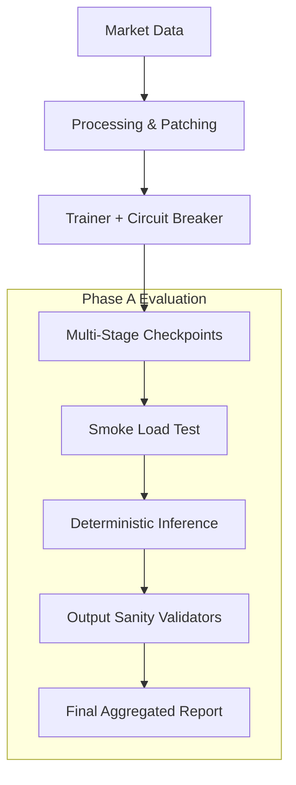

# VMarx Dione Deep Brain — Phase A Evaluation

[](https://github.com/MerariJafet/vmarx-dione-deep-brain/actions/workflows/ci.yml)
[](https://github.com/MerariJafet/vmarx-dione-deep-brain/releases)

**VMarx Dione DB** is a high-stability deep learning pipeline designed to train and evaluate Large Language Models (LLMs) on high-volatility financial time-series data. It features a robust **Circuit Breaker** architecture to manage data toxicity and ensures model integrity through rigorous **Phase A** verification protocols.

## 🌟 Why it Matters
In financial ML, data toxicity (outliers, NaNs, distribution shifts) can silently corrupt model weights. VMarx Dione solves this with:
- **Reproducibility**: Guaranteed deterministic outputs across identical seeds.
- **Validation**: Strict multi-stage evaluation (Smoke -> Inference -> Consistency).
- **Hardening**: Fail-safe checkpointing strategies to recover from toxic loops.

## 🎯 Project Goal
The current milestone showcases **Stage 1 (Base Knowledge Acquisition)**.

- **Task**: Multi-domain Financial Forecasting (Causal Language Modeling).
- **Model**: Mistral-7B-v0.1 Base with QLoRA 4-bit Adapters.
- **Dataset**: TBD (Multi-source Crypto OHLCV & Equity Time-Series).
- **Target**: Foundations for high-precision market analysis agents.

## 🚀 Quickstart (1-Command Evaluation)

Verify the model's stability and reproducibility locally in one step:

```bash
# Setup & Run all Phase A evaluators
make setup
make phasea
```
*Note: This command runs the end-to-end evaluation suite (`scripts/run_phase_a.py`) validating inventory, VRAM load, and deterministic inference.*

## 📊 Results Summary (v0.1.0)

| Metric | Result | Sourced From |
| :--- | :--- | :--- |
| **Final Training Step** | 2000 | `stage1_final_report.json` |
| **Training Loss** | 0.0762 | `stage1_final_report.json` |
| **Val Loss (Crypto)** | 0.3072 | `reports/phaseA_final_report.json` |
| **Stable Load (VRAM)** | ✅ PASS (~4.3GB MiB) | `reports/phaseA_smoke_load_summary.json` |
| **Reproducibility** | ✅ PASS (Greedy/Seed 11) | `reports/phaseA_inference_outputs.jsonl` |
| **Consistency Check** | ✅ PASS (Canonical vs Backup)| `reports/phaseA_checkpoint_consistency.json` |

## 🏗️ Architecture

The pipeline is designed for modularity and safety:



## 🔍 How to Reproduce Phase A
Phase A ensures that the `checkpoint_final` is functional and bit-identical to its training state.

1. **Inventory**: Validates existence and hash-integrity of model weights.
2. **Smoke Load**: Checks quantization health and CUDA forward pass.
3. **Inference**: Exercises the model with fixed prompts (JSON/CSV/Reasoning).
4. **Consistency**: Compares the canonical weights against the step-2000 backup.

Detailed steps are provided in [docs/USAGE.md](docs/USAGE.md).

## 📂 Repository Structure
- `scripts/`: Master evaluation wrappers and CLI entrypoints.
- `src/`: Core Python modules (Ingestion, Tokenization, Training).
- `reports/`: JSON artifacts containing full evaluation evidence.
- `docs/`: Technical deep-dives on [Architecture](docs/ARCHITECTURE.md) and [Usage](docs/USAGE.md).

## 🗺️ Roadmap
- [x] Stage 1: Base Knowledge Acquisition (2000 Steps).
- [x] Phase A: Stability & Reproducibility Verification.
- [ ] Stage 2: Instruction Fine-Tuning (SFT).
- [ ] Phase B: Quantitative Backtesting.

## 📜 License & Contributing
Licensed under MIT. Open for collaboration on financial LLM engineering. See [MODEL_WEIGHTS.md](MODEL_WEIGHTS.md) for data access details.
