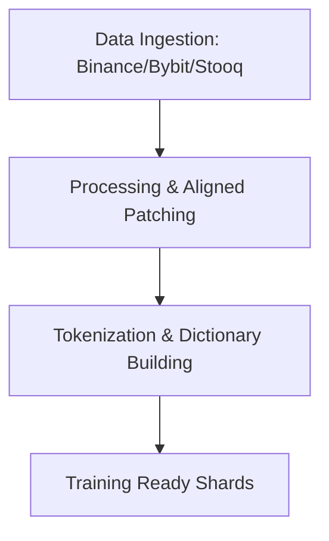
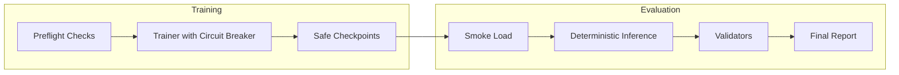

# Architecture & Pipeline

VMarx Dione DB follows a modular pipeline designed for high-stability training on potentially toxic financial data.

## 1. Data Pipeline

## 2. Training & Evaluation Flow

## 3. Core Components

- **Circuit Breaker**: Monitors loss for NaNs/Infs and "toxicity" (consecutive bad batches). Automatically reseeds RNG or skips toxic regions.
- **Watchdog**: Periodically verifies GPU health and training progress, performing emergency saves if stagnation is detected.
- **Model Loader**: Specialized for QLoRA 4-bit loading with PEFT adapter reconstruction.

## 4. Stage 1 (Current)
Stage 1 focused on **Base Knowledge Acquisition**. The model was trained on a balanced mix of crypto OHLCV and equity time-series data to build a foundational understanding of market dynamics.

## 5. Next Steps: Stage 2
Stage 2 will focus on **Instruction Following** (SFT), utilizing the stability and consistency established in Phase A.
